<!-- markdownlint-disable MD033 MD041 -->
<div align="center">


# Stickman films, directed by your AI agent, rendered as code.

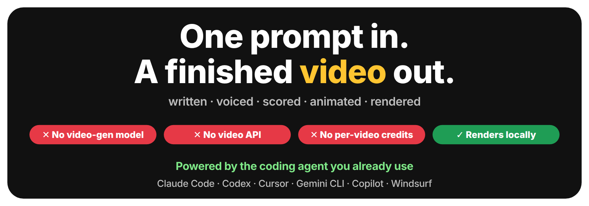

### ✍️ One prompt in → 🎞️ a finished, voiced, scored, animated video out.
### 🚫 No video-generation model · 🚫 No video API · 🚫 No per-video credits · 🖥️ Renders on your machine
**The only AI you need is the coding agent you already use:** Claude Code, Codex, Cursor, Gemini CLI, Copilot, Windsurf…

[](https://github.com/dsauce/stickman-kino/actions/workflows/ci.yml)
[](https://github.com/dsauce/stickman-kino/stargazers)
[](LICENSE)


<a href="https://dsauce.github.io/stickman-kino/#chorus"></a>

**▲ "Chorus", a 58-second ad for a made-up app.** Script, storyboard, voice, music, animation and edit were produced by an AI agent running Stickman Kino, from a short brief.<br>
<sub>Every frame is code. <a href="https://dsauce.github.io/stickman-kino/#chorus"><b>▶ Watch with sound</b></a> · <a href="https://dsauce.github.io/stickman-kino/"><b>🍿 All films</b></a> · <a href="samples/chorus/film.json">film.json</a> · <a href="samples/chorus/scenes.js">scenes.js</a></sub>

</div>

> [!IMPORTANT]
> ### 🚫 Zero video-generation AI. Not a single frame is "generated".
> No Sora. No Veo. No Runway, Kling or Pika. **No video API, no video credits to buy, no render queue, no uploading your ideas to a video service.**
> Stickman Kino is an *animation engine*: it draws every frame from code, on your machine, the way a game engine draws a game. The only AI in the loop is your coding agent, which writes the script and that code. So every video is **free, private, deterministic and fully editable**, down to a single frame, a single word or a single colour.

---

## 🎬 One prompt. One film.

Open this repo in **Claude Code, Codex, Cursor, Gemini CLI** or any coding agent and say what you want:

```text
Make a 60-second stickman ad for a made-up app that ends the "whose turn is it?"
chore fight at home. Catchy music, a compelling story, a great intro and outro.
```

The agent follows the [skills](skills) in this repo and runs the whole studio for you:

```text
✍️ script + storyboard  →  🎙️ voice-over  →  🎵 original music  →  🕺 animation  →  ✅ checks its own frames  →  🎞️ MP4
```

That's exactly how the film above was made. Want vertical for TikTok? A British narrator? Chalkboard style? Just ask.

## ✨ Why people star this

<table>
<tr><td width="33%" valign="top">

### 🆓 No per-video cost
Rendering, voice (local neural TTS), music and sound effects all run on your machine, so a film costs nothing beyond the coding agent you already use. The music and SFX are **synthesised from code**: nothing to license, nothing to get copyright-struck.

</td><td width="33%" valign="top">

### 🎯 Actually controllable
AI video is a slot machine: characters drift, text melts, and you can't fix frame 214. Here the character is the **same rig in every shot**, text is crisp, charts show real numbers, and "make the bar blue" is a one-line change.

</td><td width="33%" valign="top">

### 🤖 Agent-native
Four battle-tested skills (director, animator, sound, producer) teach any coding agent to **direct**: hooks in the first 3 s, visual change every 2-3 s, actions synced to the narrator's words, and a QA loop that **looks at its own frames**.

</td></tr>
</table>

| | Stock footage / manual tools | AI video models | **Stickman Kino** |
|---|:---:|:---:|:---:|
| Same character in every shot | ✅ | ⚠️ drifts | ✅ |
| Readable text, real numbers, live charts | ✅ | ❌ | ✅ |
| Fix one moment without regenerating | ✅ | ❌ | ✅ |
| Voice-over synced to the action | hours | random | ✅ word-level cues |
| Licence-free music & SFX | 💸 | - | ✅ generated |
| Video-generation API, keys or credits | - | required | **none** |
| From a plain-English prompt | ❌ | ✅ | ✅ |
| Extra cost per video | hours of work | credits per clip | **$0** (beyond your agent) |

## 🧰 What's in the box

<table>
<tr>
<td width="50%" valign="top">

**🕺 A real stickman rig.** 58 poses, 4-phase walk and run cycles, jump, climb, sit, kneel, fall, throw, arms that reach for any point (IK), 6 facial emotions, and 14 characters (Zeke, office, builder, scientist, chef, king, robot, kid…) with hats, hair, shirts, dresses and props in hand.

**📦 202 props.** Office, tech, money, home and chores, nature, transport, science, cinema, symbols. One consistent line-art style, theme-aware, crisp at any size.

**📊 19 charts and diagrams.** Bar, line, pie/donut, counters, stats, progress, gauge, flowcharts with moving tokens, timelines, venn, versus split, network, pyramid, cycle, 2×2 matrix, funnel, table, balance scale.

**🎞️ 8 intros and outros.** Film-leader countdown, clapperboard snap, logo reveal, spotlight; CTA card, rolling credits, YouTube end screen, "made with" sting. Declared in one line of JSON.

</td>
<td width="50%" valign="top">

**✍️ Kinetic typography.** 12 entrances, highlight / underline / strike / circle any word, titles, lower thirds, labels with arrows, speech and thought bubbles, checklists, word slams, quotes, **auto captions** from the voice-over.

**🎥 Camera, FX, worlds.** Focus, push, follow, whip and shake; confetti, sparkles, impacts, ripples and 18 more effects; 15 transitions; city, road, ocean, office, stage, space, park; 8 themes plus your brand colours.

**🔊 Audio with zero licensing.** Free local voice (Kokoro: 12 voices in 5 languages), 9 procedural music styles including a catchy sectioned **pop** track, 41 synthesised sound effects, loudness-normalised mix.

**🛠️ A friendly CLI.** `new`, `build`, `check`, `snapshot`, `render`, `gif`, `prompts`… plus a no-sudo `setup` that fixes Chrome on Linux/WSL.

</td>
</tr>
</table>

<div align="center">
<a href="https://dsauce.github.io/stickman-kino/#titles"></a><br>
<sub>The 8 intro/outro presets. <a href="samples/titles/film.json">This whole film is 18 lines of JSON</a>, no scene code.</sub>
</div>

## 🍿 More films made with Stickman Kino

▶ **Watch them all with sound on the [film page](https://dsauce.github.io/stickman-kino/).**

| Hello, Stickman · 15 s | Compound interest · 50 s | The 2-minute rule · 9:16 | Showcase · 44 s |
|:---:|:---:|:---:|:---:|
| <a href="https://dsauce.github.io/stickman-kino/#hello-stickman"></a> | <a href="https://dsauce.github.io/stickman-kino/#compound-interest">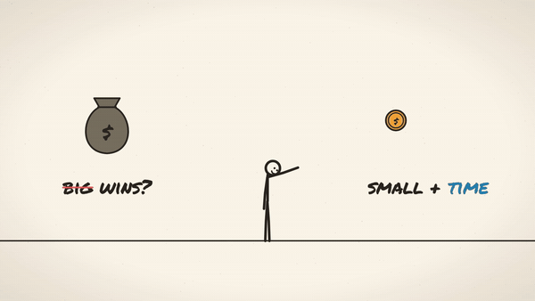</a> | <a href="https://dsauce.github.io/stickman-kino/#two-minute-rule">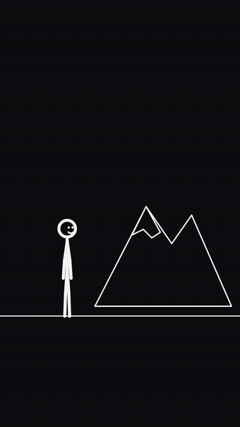</a> | <a href="https://dsauce.github.io/stickman-kino/#showcase">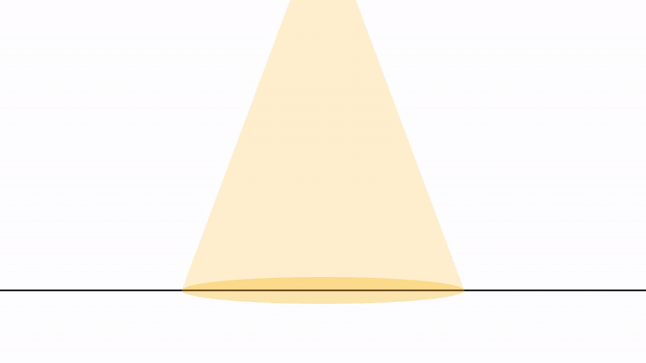</a> |
| the smallest film: start here | paper theme, charts, British voice | dark theme, pop captions, TikTok-ready | three themes, camera follow, logo outro |

<details>
<summary><b>🗂️ Browse the full catalogue (poses, props, characters, charts, diagrams, typography, themes, environments)</b></summary>

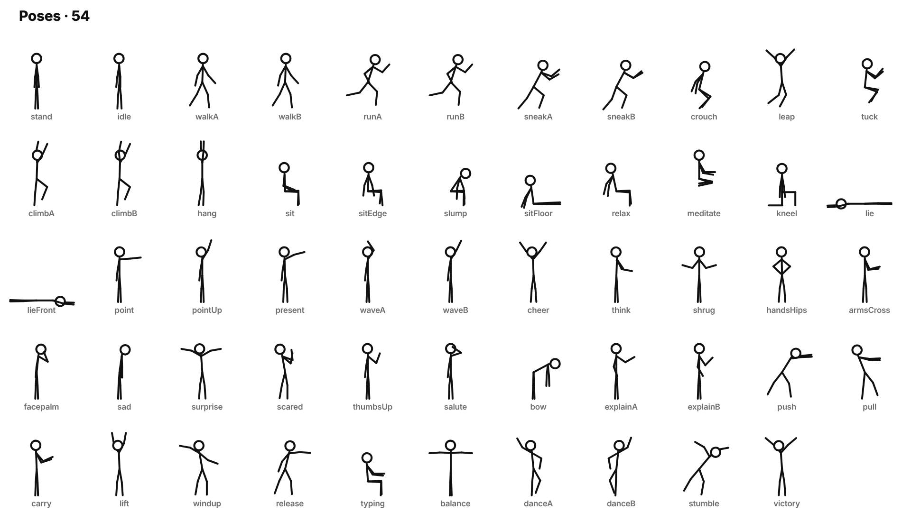
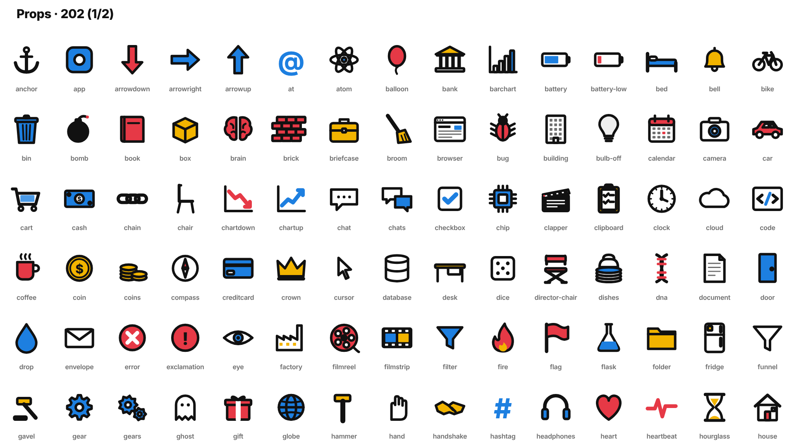
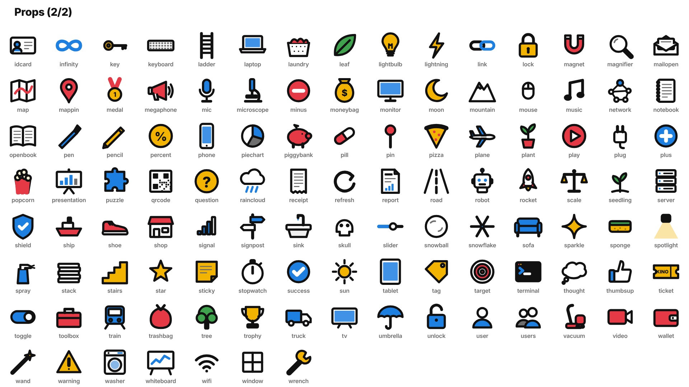
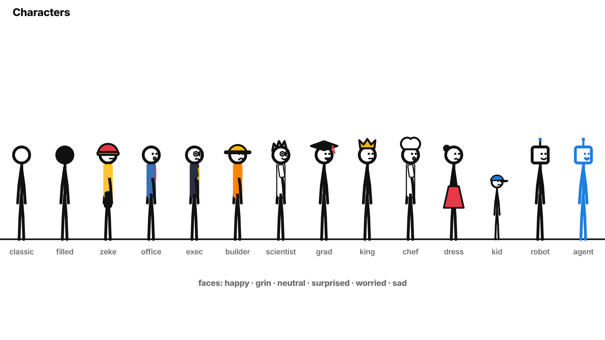
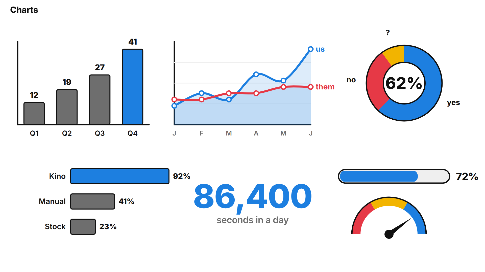
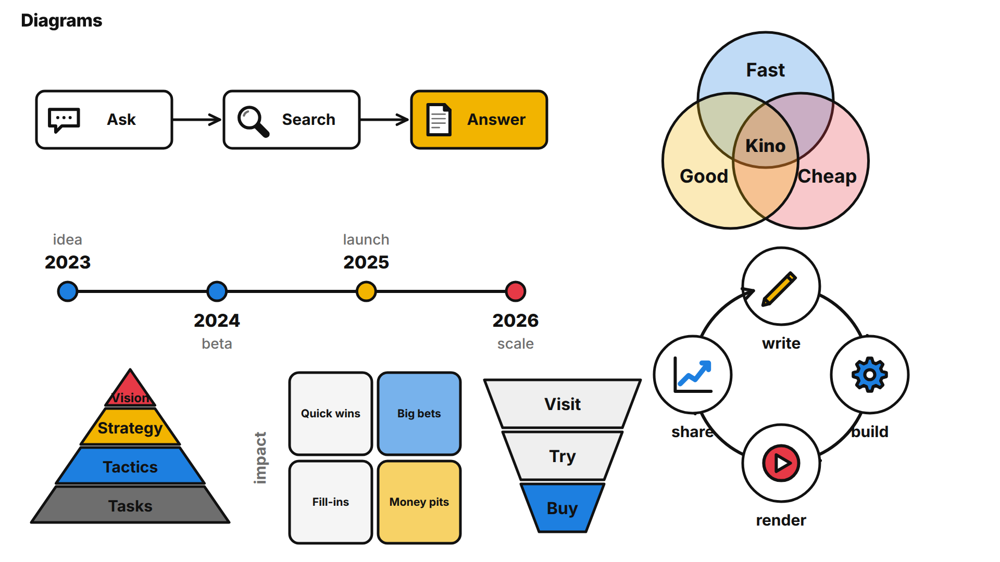
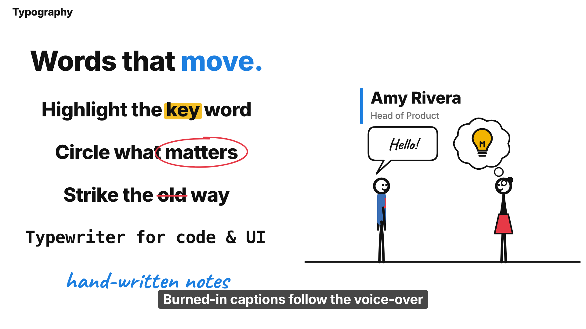
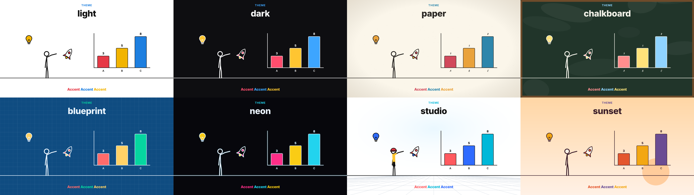
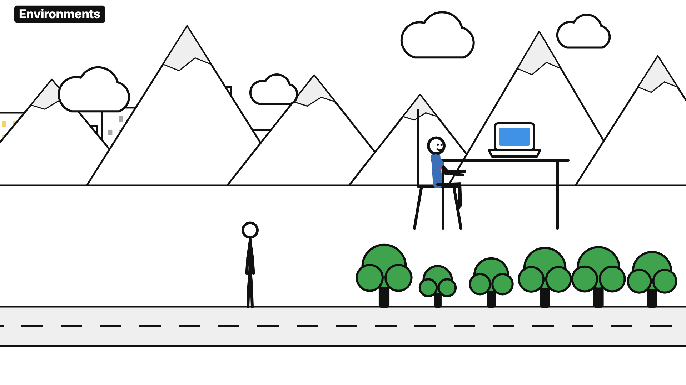

</details>

## 🚀 Quick start

```bash
git clone https://github.com/dsauce/stickman-kino.git && cd stickman-kino
npm install
node bin/stickman.mjs setup                    # Chrome libs + free local voice (no sudo, no API keys)
node bin/stickman.mjs build samples/chorus     # → samples/chorus/renders/chorus.mp4
```

**What you need:** Node 18+ and a coding agent that can run terminal commands on your computer (Claude Code, Codex CLI, Cursor, Gemini CLI, Copilot agent mode, Windsurf…). Chat-only web apps like ChatGPT or claude.ai can't run the renderer themselves; they can draft `film.json` and `scenes.js` for you to build with the CLI. Cloud coding agents may work but are untested.

Now open the folder in your agent and ask for *your* film. Or install the skills everywhere:

```bash
node bin/stickman.mjs install-skills    # Claude Code, Codex and ~/.agents, so it works in any project
```

Claude Code users can also run `/plugin marketplace add dsauce/stickman-kino`.

<details>
<summary><b>Prefer to write it yourself? A whole clip is a few lines.</b></summary>

```js
// scenes.js
film.scene("hook", sc => {
  sc.ground();
  const bob = sc.figure({ x: -150, face: "dots" });
  const t = bob.walkTo(sc.W * 0.35, 0.2);              // every action returns its end time
  bob.point(sc.W * 0.7, sc.H * 0.4, t);
  sc.barChart({ x: sc.W * 0.68, y: sc.H * 0.45, data: [{ label: "2024", value: 4 }, { label: "2025", value: 9 }] })
    .grow(sc.cue("doubled"));                          // lands on the word "doubled" in the voice-over
  sc.text("Revenue [doubled]", { x: sc.W * 0.68, y: 150, size: 80 }).in(sc.cue("doubled"), "words");
  sc.exit("wipe-left");
});
```

```json
// film.json: an intro in one line
{ "id": "intro", "intro": { "style": "countdown", "title": "Whose [turn] is it?" } }
```

`stickman new videos/my-film --format 9:16 --music pop` scaffolds a film with an intro, three scenes and an outro.

</details>

## ⚙️ How it works

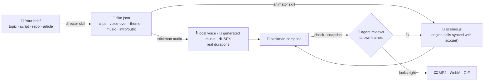

Under the hood each film is a [HyperFrames](https://github.com/heygen-com/hyperframes) composition: one paused GSAP timeline that headless Chrome seeks frame by frame. Same inputs, same pixels, every time. More in [docs/how-it-works.md](docs/how-it-works.md).

## 📚 Documentation

| | |
|---|---|
| [Getting started](docs/getting-started.md) | install, first film, the CLI |
| [Using with agents](docs/agents.md) | Claude Code, Codex, Cursor, Gemini CLI, Copilot, Windsurf, Aider |
| [film.json reference](docs/film-json.md) | every field, intros/outros, captions ([JSON Schema](schema/film.schema.json)) |
| [Engine API](docs/engine-api.md) | figures, props, text, charts, camera, FX, worlds, transitions, titles |
| [Cookbook](skills/stickman-animator/references/cookbook.md) | 17 tested recipes for classic explainer moments |
| [Characters & poses](docs/characters-and-poses.md) · [Props](docs/props.md) · [Themes](docs/themes.md) | the catalogue |
| [Audio](docs/audio.md) | voices, music styles, SFX, loudness |
| [AI-video prompts](docs/ai-video-prompts.md) | *optional*: export the same storyboard as prompts for Gemini / Veo / Sora / Kling |
| [How it works](docs/how-it-works.md) · [Troubleshooting](docs/troubleshooting.md) · [FAQ](docs/faq.md) | under the hood, fixes, answers |

## 🗺️ Roadmap

- [ ] More characters (animals, elders, wheelchair user) and outfits
- [ ] Lip-flap mouths driven by the voice-over
- [ ] Word-exact cue timing via local Whisper alignment
- [ ] Two-figure interactions (handshake, high-five, carry together)
- [ ] One script → many languages (VO + captions)
- [ ] A browser playground to preview every prop, pose and recipe

Ideas? [Open a feature request](https://github.com/dsauce/stickman-kino/issues/new/choose). Made something? Share it in [Discussions](https://github.com/dsauce/stickman-kino/discussions) 🎉

## 🤝 Contributing

New props, poses, characters, music styles and recipes are the easiest wins, and each one shows up in everyone's next film. See [CONTRIBUTING.md](CONTRIBUTING.md).

## 👋 Author

Stickman Kino is created and maintained by **Prerit Ahuja**.

<a href="https://preritahuja.com/"></a>
<a href="https://www.linkedin.com/in/ahujaprerit/"></a>
<a href="https://github.com/dsauce"></a>

Questions, ideas or a cool film you made? Say hi on [LinkedIn](https://www.linkedin.com/in/ahujaprerit/) or open a [Discussion](https://github.com/dsauce/stickman-kino/discussions).

## 🙏 Credits

Rendering by [HyperFrames](https://github.com/heygen-com/hyperframes) (Apache-2.0) · animation by [GSAP](https://gsap.com) (installed from npm, not redistributed) · voice by [Kokoro-82M](https://huggingface.co/hexgrad/Kokoro-82M) (Apache-2.0) · fonts Inter, Caveat and Permanent Marker (OFL). The five-beat story arc and the optional AI-video prompt format are inspired by [kaomei/stickman-video-director](https://github.com/kaomei/stickman-video-director) (MIT). Full list in [THIRD_PARTY_NOTICES.md](THIRD_PARTY_NOTICES.md).

## 📄 License

[MIT](LICENSE) © [Prerit Ahuja](https://preritahuja.com/). Use it for anything, commercial included. Music and SFX made by Stickman Kino are generated from scratch and are yours. *Chorus is a fictional product invented for the demo.*

---

<div align="center">

**If Stickman Kino saved you a weekend (or a video budget), a ⭐ helps others find it.**

<sub>Built by <a href="https://preritahuja.com/">Prerit Ahuja</a> · <a href="https://www.linkedin.com/in/ahujaprerit/">LinkedIn</a> · <a href="https://github.com/dsauce">GitHub</a></sub>

<a href="https://github.com/dsauce/stickman-kino/stargazers"></a>

<a href="https://star-history.com/#dsauce/stickman-kino&Date"></a>

</div>
