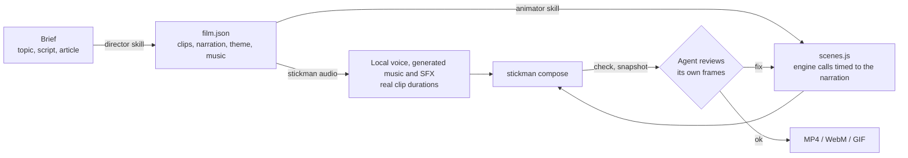

<!-- markdownlint-disable MD033 MD041 -->
<div align="center">


# Stickman films, directed by your coding agent, rendered as code.

No video-generation model, no video API, renders locally.

[](https://github.com/dsauce/stickman-kino/actions/workflows/ci.yml)
[](LICENSE)


<a href="https://dsauce.github.io/stickman-kino/#chorus"></a>

**Chorus**, a 58-second ad for a made-up app. A coding agent produced it with Stickman Kino from a short brief: script, storyboard, voice-over, music, animation and render.<br>
<a href="https://dsauce.github.io/stickman-kino/#chorus"><b>Watch with sound</b></a> · <a href="https://dsauce.github.io/stickman-kino/"><b>All films</b></a> · <a href="samples/chorus/film.json">film.json</a> · <a href="samples/chorus/scenes.js">scenes.js</a>

</div>

> [!NOTE]
> **Nothing here generates pixels.** There is no Sora, Veo, Runway or other video model, and no video API or per-video credits. Your coding agent (Claude Code, Codex, Cursor, Gemini CLI and similar) writes a script and scene code; a small engine draws every frame from that code on your machine. The agent is the only AI in the loop.

## What it does

You ask your coding agent for a film:

```text
Make a 60-second stickman ad for a made-up app that ends the "whose turn is it?"
chore fight at home. Catchy music, a clear story, an intro and an outro.
```

The agent follows the [skills](skills) in this repo and produces two files:

- `film.json`: the clips, narration, theme, music, intro and outro
- `scenes.js`: the choreography, written against the engine

Then it runs the pipeline: voice-over and music are generated locally, the film is composed, checked, snapshotted for visual review, and rendered to MP4. Chorus above was made this way.

## How it works



- **Rendering is deterministic.** A film is a [HyperFrames](https://github.com/heygen-com/hyperframes) composition: one paused GSAP timeline, seeked frame by frame in headless Chrome. No clocks, randomness or network calls are allowed in scene code (the engine has a seeded RNG, and a test enforces this). Same inputs, same pixels.
- **Narration drives timing.** Each clip's voice-over is synthesised first, so clip lengths come from real audio. Scenes then place actions on words, for example `chart.grow(sc.cue("doubled"))`.
- **The agent checks its work.** The skills require `stickman check` (lint, runtime, layout and contrast checks) and a look at snapshot contact sheets before rendering.

More detail in [docs/how-it-works.md](docs/how-it-works.md).

## Why stick figures

A rigged stick figure is identical in every shot, which is the main thing generated video still struggles with. Because poses and positions are plain numbers in code, an agent can reason about them, place a hand on a chart or walk a character to a mark, and fix one moment without touching the rest. The style also suits explainers, where clarity matters more than realism.

## Why it's different

| | Manual tools / stock footage | AI video models | Stickman Kino |
|---|---|---|---|
| Same character in every shot | Yes | Drifts | Yes |
| Readable text, real numbers, charts | Yes | Often garbled | Yes |
| Fix one moment without regenerating | Yes | No | Yes |
| Narration synced to actions | Manual | Unreliable | Word-level cues |
| Music and SFX licensing | Paid or manual | n/a | Generated from code |
| Video API or per-video credits | No | Required | No |
| Works from a plain-English request | No | Yes | Yes, via your coding agent |

## What's in the box

- **Four agent skills** (director, animator, sound, producer): a five-beat story structure, a word budget per clip, three visual beats per clip, narration-synced actions, and a mandatory review loop.
- **A stick figure rig:** 58 poses, walk and run cycles, jump, climb, sit, kneel, fall and throw, two-bone arm IK (`reach`, `point`, `tap`), simple faces, and 14 character presets with hats, hair, shirts, dresses and props in hand.
- **202 props** in one line-art style, theme-aware, constant line weight at any size.
- **19 chart and diagram types:** bar, line, pie and donut, counters, progress, gauge, flowcharts with moving tokens, timelines, venn, versus split, network, pyramid, cycle, 2x2 matrix, funnel, table, balance scale.
- **Text:** 12 entrance effects, word highlight, underline, strike and circle, titles, lower thirds, labels, speech and thought bubbles, checklists, and captions generated from the narration.
- **Camera, effects and scenes:** focus, push, follow, whip and shake; 22 effects; 15 transitions; environments such as city, road, office and stage; 8 themes plus custom brand colours.
- **Intros and outros:** 4 of each (countdown, clapperboard, logo, spotlight; call to action, credits, end screen, "made with"), declared in one line of `film.json`.
- **Local audio:** Kokoro text-to-speech (12 voices), 9 procedurally generated music styles, 41 synthesised sound effects, loudness-normalised mix. No samples, so nothing to license.
- **CLI:** `new`, `build`, `audio`, `check`, `snapshot`, `render`, `gif`, `prompts`, `list`, and a `setup` that works without sudo on Linux and WSL.

<div align="center">
<a href="https://dsauce.github.io/stickman-kino/#titles"></a><br>
<sub>The 8 intro and outro presets. <a href="samples/titles/film.json">This film is 18 lines of JSON</a> with no scene code.</sub>
</div>

## More sample films

All of these are in [`samples/`](samples) with their source. [Watch them with sound](https://dsauce.github.io/stickman-kino/).

| Hello, Stickman (15 s) | Compound interest (50 s) | The 2-minute rule (9:16) | Showcase (44 s) |
|:---:|:---:|:---:|:---:|
| <a href="https://dsauce.github.io/stickman-kino/#hello-stickman"></a> | <a href="https://dsauce.github.io/stickman-kino/#compound-interest"></a> | <a href="https://dsauce.github.io/stickman-kino/#two-minute-rule"></a> | <a href="https://dsauce.github.io/stickman-kino/#showcase"></a> |
| the smallest complete film | paper theme, charts, British voice | dark theme, captions from narration | three themes, camera follow |

<details>
<summary><b>Full catalogue: poses, props, characters, charts, diagrams, typography, themes, environments</b></summary>


</details>

## Quick start

**You need:** Node 18 or newer, and a coding agent that can run terminal commands on your computer (Claude Code, Codex CLI, Cursor, Gemini CLI, Copilot agent mode, Windsurf and similar). Python 3.10 to 3.12 is optional, for the local voice.

```bash
git clone https://github.com/dsauce/stickman-kino.git && cd stickman-kino
npm install
node bin/stickman.mjs setup                    # finds or fixes Chrome, installs the local voice, checks the toolchain
node bin/stickman.mjs build samples/chorus     # writes samples/chorus/renders/chorus.mp4
```

Then open the folder in your agent and ask for a film. To use the skills in any project:

```bash
node bin/stickman.mjs install-skills    # copies the skills to ~/.claude/skills, ~/.codex/skills and ~/.agents/skills
```

Claude Code can also load it as a plugin: `/plugin marketplace add dsauce/stickman-kino`.

<details>
<summary><b>Writing scenes by hand</b></summary>

```js
// scenes.js
film.scene("hook", sc => {
  sc.ground();
  const bob = sc.figure({ x: -150, face: "dots" });
  const t = bob.walkTo(sc.W * 0.35, 0.2);              // every action returns its end time
  bob.point(sc.W * 0.7, sc.H * 0.4, t);
  sc.barChart({ x: sc.W * 0.68, y: sc.H * 0.45, data: [{ label: "2024", value: 4 }, { label: "2025", value: 9 }] })
    .grow(sc.cue("doubled"));                          // starts when the narrator says "doubled"
  sc.text("Revenue [doubled]", { x: sc.W * 0.68, y: 150, size: 80 }).in(sc.cue("doubled"), "words");
  sc.exit("wipe-left");
});
```

```json
{ "id": "intro", "intro": { "style": "countdown", "title": "Whose [turn] is it?" } }
```

`node bin/stickman.mjs new videos/my-film --format 9:16 --music pop` scaffolds a film with an intro, three scenes and an outro.

</details>

## Documentation

| | |
|---|---|
| [Getting started](docs/getting-started.md) | install, first film, the CLI |
| [Using with agents](docs/agents.md) | Claude Code, Codex, Cursor, Gemini CLI, Copilot, Windsurf, Aider |
| [film.json reference](docs/film-json.md) | every field, intros and outros, captions ([JSON Schema](schema/film.schema.json)) |
| [Engine API](docs/engine-api.md) | figures, props, text, charts, camera, effects, environments, transitions, titles |
| [Cookbook](skills/stickman-animator/references/cookbook.md) | 17 tested recipes for common explainer moments |
| [Characters and poses](docs/characters-and-poses.md) · [Props](docs/props.md) · [Themes](docs/themes.md) | the catalogue |
| [Audio](docs/audio.md) | voices, music styles, sound effects, loudness |
| [AI-video prompts](docs/ai-video-prompts.md) | optional export of the same storyboard as text-to-video prompts |
| [How it works](docs/how-it-works.md) · [Troubleshooting](docs/troubleshooting.md) · [FAQ](docs/faq.md) | internals, fixes, answers |

## Limitations

- **Cue timing is approximate.** Word times are estimated from the text and the measured clip duration, not forced-aligned to the audio. Local Whisper alignment is on the roadmap.
- **No two-figure interactions yet.** Characters can share a scene and react to each other, but there are no helpers for handshakes, carrying things together and similar.
- **It needs a local toolchain.** Node 18+ and a Chrome or Chromium. Chat-only tools (ChatGPT, claude.ai) can draft `film.json` and `scenes.js`, but cannot render.
- **Agent self-review has limits.** It reliably catches layout problems such as overlaps, clipping and off-screen elements. It is weaker on timing and on taste.
- **Rendering is CPU-bound.** About 2 to 3 minutes per minute of 1080p on a laptop without a GPU. Draft quality and snapshots are much faster.
- **Stick figures only.** The look is deliberately simple; there is no photoreal or 3D mode.

## Related work

Video as code is not new: [Remotion](https://www.remotion.dev), [Manim](https://www.manim.community) and [Motion Canvas](https://motioncanvas.io) are mature and more general. The difference here is the agent skills that do the directing (story, timing, review), plus a built-in rig, prop library and local audio pipeline aimed at one specific format: narrated stick-figure explainers. The optional prompt export and the five-beat story structure draw on [kaomei/stickman-video-director](https://github.com/kaomei/stickman-video-director).

## Roadmap

- Word-accurate cue timing with local Whisper alignment
- Two-figure interactions (handshake, high-five, carry together)
- Mouth movement driven by the narration
- More characters and outfits
- One script, several languages (voice and captions)

Ideas and bug reports are welcome in [issues](https://github.com/dsauce/stickman-kino/issues/new/choose) and [discussions](https://github.com/dsauce/stickman-kino/discussions).

## Contributing

New props, poses, characters, music styles and recipes are the easiest places to start. See [CONTRIBUTING.md](CONTRIBUTING.md).

## Author

**Prerit Ahuja** · [preritahuja.com](https://preritahuja.com/) · [LinkedIn](https://www.linkedin.com/in/ahujaprerit/) · [GitHub](https://github.com/dsauce)

I work on making AI reliable enough for sustained real-world use; this is a side project exploring that idea in video.

## Credits

Rendering by [HyperFrames](https://github.com/heygen-com/hyperframes) (Apache-2.0), animation by [GSAP](https://gsap.com) (installed from npm, not redistributed), voice by [Kokoro-82M](https://huggingface.co/hexgrad/Kokoro-82M) (Apache-2.0), fonts Inter, Caveat and Permanent Marker (OFL). Full list in [THIRD_PARTY_NOTICES.md](THIRD_PARTY_NOTICES.md).

## License

[MIT](LICENSE) © [Prerit Ahuja](https://preritahuja.com/). Music and sound effects produced by Stickman Kino are generated from scratch and are yours to use. Chorus is a fictional product made up for the demo.

If this is useful to you, a star helps other people find it.
